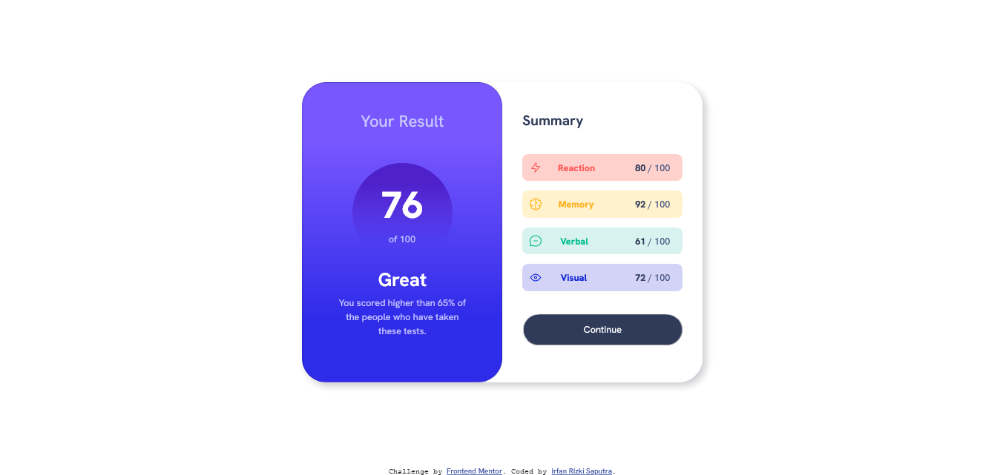
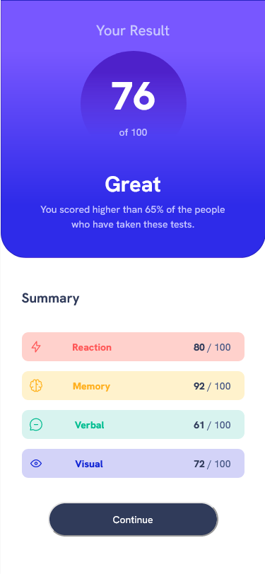

# Frontend Mentor - Results summary component solution

This is a solution to the [Results summary component challenge on Frontend Mentor](https://www.frontendmentor.io/challenges/results-summary-component-CE_K6s0maV). Frontend Mentor challenges help you improve your coding skills by building realistic projects. 

## Table of contents

- [Overview](#overview)
  - [Screenshot](#screenshot)
  - [Links](#links)
- [My process](#my-process)
  - [Built with](#built-with)
  - [What I learned](#what-i-learned)
  - [Continued development](#continued-development)
  - [Useful resources](#useful-resources)
- [Author](#author)


## Overview
this project is to build out this results summary component and get it looking as close to the design as possible. 

### The challenge

Users should be able to:

- View the optimal layout for the interface depending on their device's screen size
- See hover and focus states for all interactive elements on the page

### Screenshot




### Links

- Solution URL: [Github Repository](https://github.com/nafri97/results-summary-component-main)
- Live Site URL: [Github Pages](https://nafri97.github.io/results-summary-component-main)

## My process

### Built with

- Semantic HTML5 markup
- CSS custom properties

### What I learned
 this code I learn pretty much, such as : responsiveness, gradient background, box-shadow, etc.

```css
  @media screen and (max-width:600px) {
}
``` ^^this code used for in resolution <=600 will appplied.
```css
  background: linear-gradient(to bottom, hsl(252, 100%, 67%) 20%,hsl(241, 81%, 54%) 80%);
```^^this code is used to made gradient background between 20%-80% with selected hsl color.
```css
  box-shadow: 5px 5px 10px rgba(12, 5, 29, 0.2);
```^^this code is used for add box shadow  '5px' xy offset shadow, '10px' radius of shadow, and dark purple color with '0.2' opacity.

### Continued development
  this code I wasn't know how to using .js or .json so in the future i will learn them after I mastered enough using css.

### Useful resources

- [W3school](https://www.w3schools.com) - this helped me which code I decide to use.
- [chatGPT](https://www.chat.openai.com) - this is amazing it could fix my code (altough sometime its code doesn't work as i wanted)

## Author

- Github - [nafri97](https://gihub.com/nafri97)
- Frontend Mentor - [@nafri97](https://www.frontendmentor.io/profile/nafri97)
- Twitter - [@irfanrizkis](https://www.twitter.com/irfanrizkis)